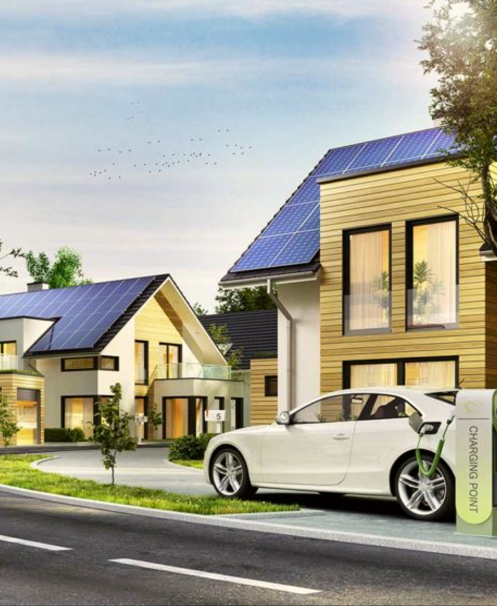

# The Solar Plants

Have you ever wanted at least a small solar panel to your home :3 ❔ 

<br>

**Now you have a chance to see a little more about solar panels in my fictional company "SolP1"! Well, her website, to be exact.:)** 

### The goals of its creation were to show:
<ul>
    <li>✅ Layout from layout </li>
    <li>✅ Ability to adapt layout </li>
    <li>✅ *Ability to apply the basics of the BEM methodology  </li>
    <li>✅ Show knowledge of CSS 3 and HTML 5</li>
</ul>

/* <br>
BEM was developed by "Yandex inc." (Sub-sanctioned R***ian company) <br>
*/


<br>

## 🔨 Structure

🏢 _The site was builded according the Block method of site-making and according the BEM methodology_ 🏢
1) firstly, I have used the <!DOCTYPE> for declare
 HTML 5.

2) secondly, I have connected the external styles (including nulling style) to the main HTML layout with indicating in the <meta> element the main language "English" - en.

```html
<!DOCTYPE html>
<html lang="en">
<head>
	<meta charset="UTF-8">
	<meta name="viewport" content="width=100%, initial-scale=1.0">
	<!-- The connection with Bootstrap library-->
	<link href="https://cdn.jsdelivr.net/npm/bootstrap@5.0.2/dist/css/bootstrap.min.css" rel="stylesheet" integrity="sha384-EVSTQN3/azprG1Anm3QDgpJLIm9Nao0Yz1ztcQTwFspd3yD65VohhpuuCOmLASjC" crossorigin="anonymous">

	<!-- The connection with the external styles-->
	<link rel="stylesheet" type="text/css" href="StyleSolarP_null.css">
	<link rel="stylesheet" type="text/css" href="StyleSolarP.css">
	<title> Solar Panels </title>
</head>
```

➡️ after that, strictly organized blocks were formed in the body tag into which the site structure is divided by meaning

1) header
2) div with class "services"
3) div with class "green_tariff"
4) div with class "quote"
5) div with class "clients"
6) div with class "five_steps"
7) footer
<br>

<br>
⏩ And there was used the BEM method with every inherent element of block, taking into account the nesting of "blocks in blocks" 🎏

```html 

    <div class="five_steps">
		<div class="five_steps__textes">
			<h3> 5 STEPS TO YOUR OWN POWER PLANT </h3>

			<!-- The monolite subsequence of textes -->
			<div class="textes__text">
				<p> 01 </p>
				<h4> Application or call </h4>
				Leave a request on our website or contact us by phone or messengers.
			</div>
			<div class="textes__text">
				<p> 02 </p>
				<h4> Consultation and measurement on site </h4>
				We calculate more than 10-15 options for a solar
				station on your site in order to offer you the most profitable one.
			</div>
			<div class="textes__text">
				<p> 03 </p>
				<h4> Conclusion of an agreement </h4>
				A contract is concluded, thanks to which you
				will be insured against low-quality equipment
				and missed deadlines.
			</div>
			<div class="textes__text">
				<p> 04 </p>
				<h4> SES installation </h4>
				Our specialists install solar panels,
				wiring and inverters, if necessary, make supports.
			</div>
			<div class="textes__text">
				<p> 05 </p>
				<h4> Receiving income from the state </h4>
				After connecting to the "Green Tariff",
				you receive income for each kilowatt generated at
				your solar power plant at
				a fixed tariff at the time of connection.
			</div>
		</div>
		
	</div>
```

<br>

⏩ A special form has been added to the 'footer' for submitting an application for the acquisition of a further action plan for our solar panels 🎇

<br>

```html

<footer>
	<div class="register">
		<h3> SUBMIT YOUR APPLICATION </h3>

		<!-- form of the getting start plan -->
		<form action="#" method="post" enctype="multipart/form-data">
			<input type="text" name="username" value="" placeholder="Name" />
			<input type="text" name="telephone" value="" placeholder="Number phone" />
			</form>
		<button> Get the plan! </button>
	</div>

	<!-- The textes about the information (places,affiliated societies, telephone numbers) -->
	<div class="footer__textes">
		<h3> Contacts </h3>
		<div class="textes_textes">
			<p>
			Main office: <br>
			Berlin, st, Zwinglistraße 742, 4st floor
			</p>
			<p>
			Representation in Oslo: <br>
			Oslo, st. Ryenbergveien, 103 of. 410
			</p>
			<p>
			Representative offices in Berlin, Oslo,Warsaw, Zurich, Praha
			</p>
			<p>
			+42 2 600 xx xx <br>
			+49 152 90xxxx
			</p>
			<p>
			Daily 08:00 - 20:00
			</p>
		</div>
	</div>
</footer>

```
<br>
<br>

### ⚠️ _All styles was descibed in StyleSolarP.css_ ⚠️

<br>


### Challenges for the future regards to FrontEnd:

* [x] Develop layout skills
* [x] Learning java script
* [x] Creation of a real site under the order

**Of course the program was made for educational purposes, but in the future I will create more serious sites.**


